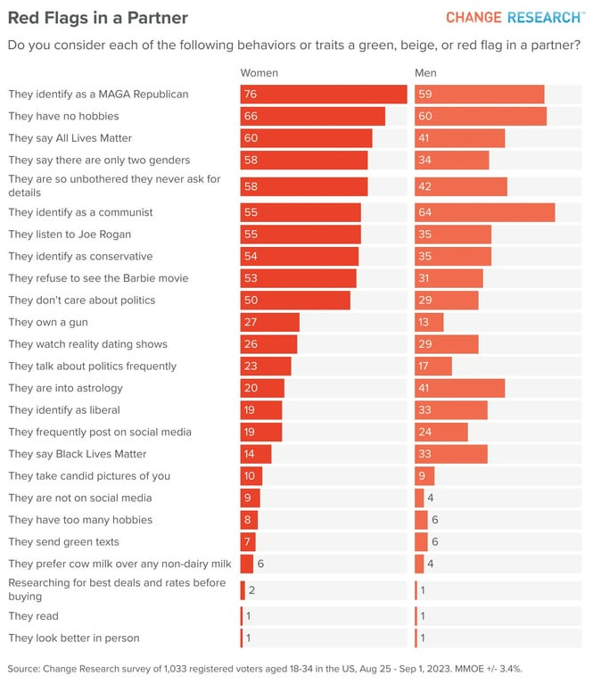

# RedFlags

Red Flags is all about the playful exploration of relationships. Share your insights, cast votes, and uncover red flags with a touch of humor.

## Tech Stack  

**Client:** React

**Server:** Firebase

## Features  

- Vote on red flags
- Demographic information  
- Comment section for each red flag
- Data visualization
- User submitted red flags (manually reviewed)

## Lessons Learned  

What did you learn while building this project? What challenges did you face and how did you overcome them?  

## Inspiration

I recently saw a funny graphic and wanted to expand upon and crowdsource the idea:

## License  

[MIT](https://choosealicense.com/licenses/mit/)  
